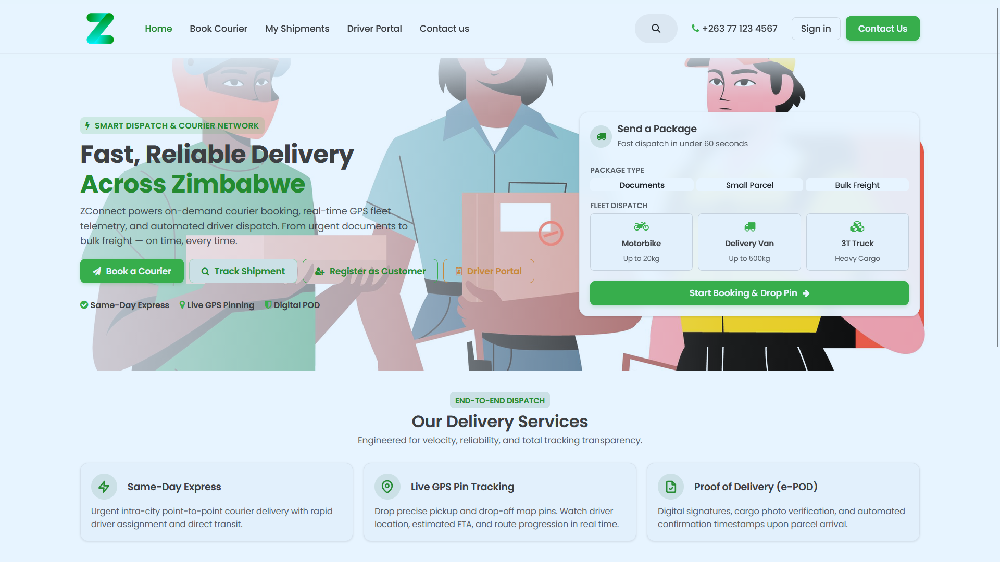
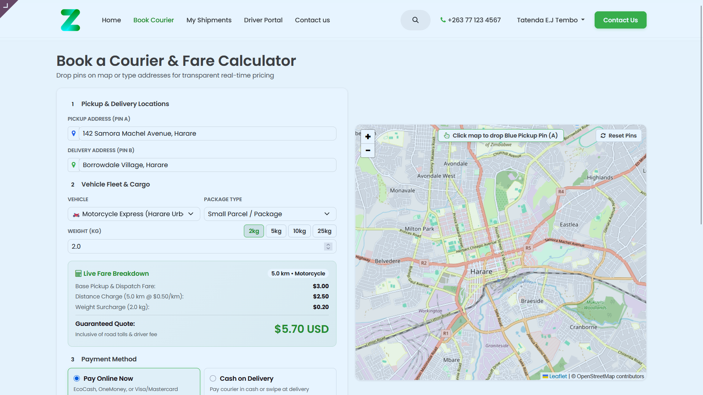
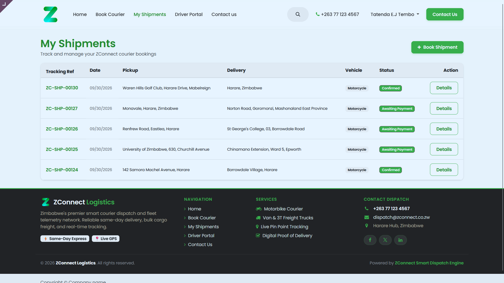
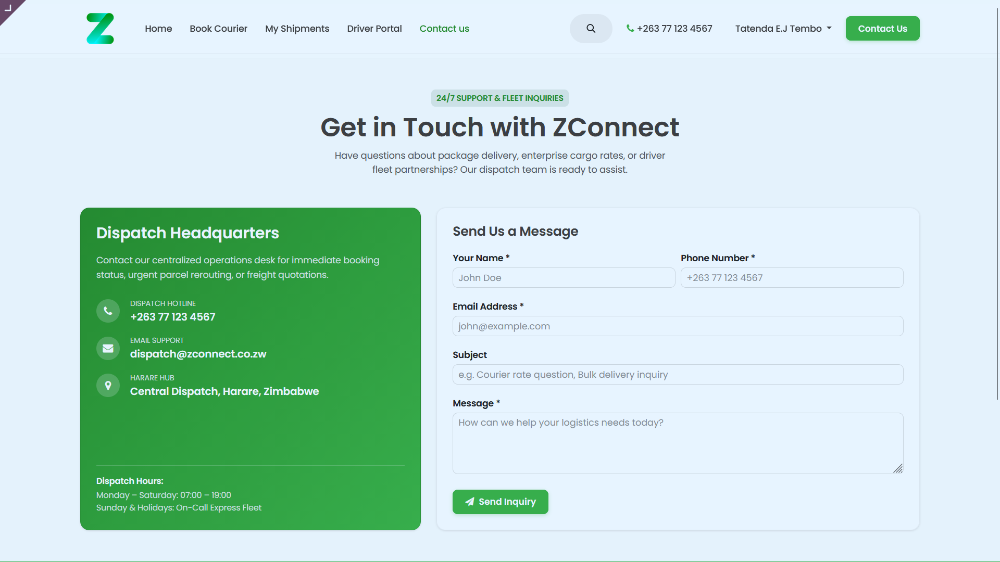
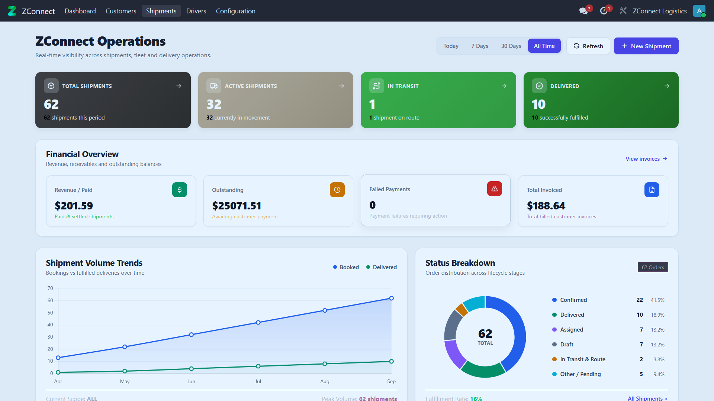
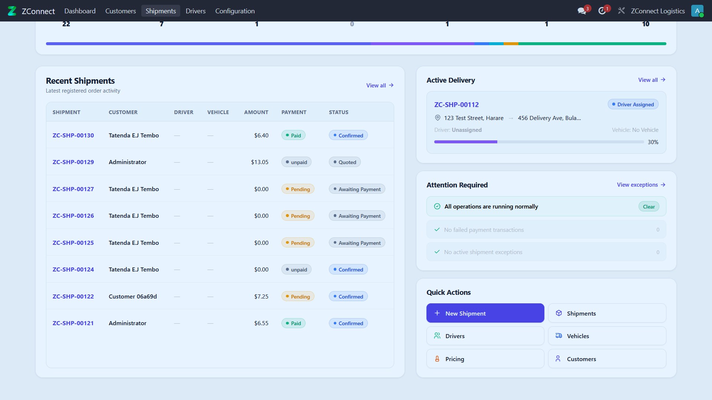
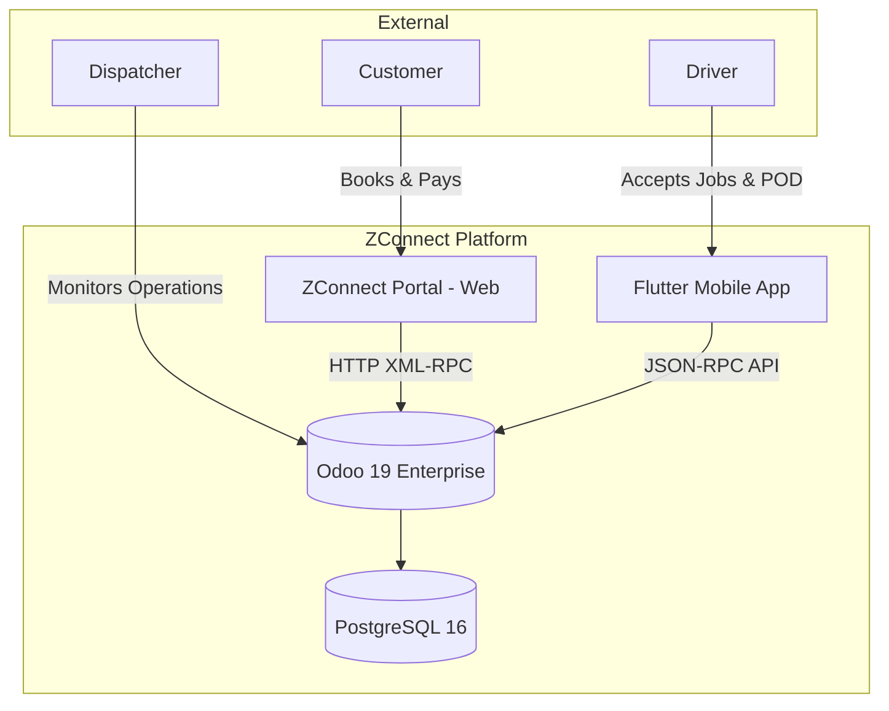
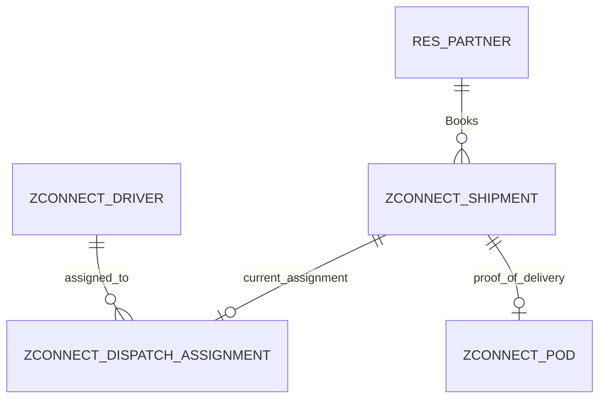

# ZConnect Logistics Platform — Comprehensive Technical Documentation

**Author:** Tatenda Tembo
**Role:** Lead Odoo Enterprise Architect
**Target System:** Odoo 19 Enterprise, PostgreSQL 16
**Last Updated:** September 2026

---

## 1. Executive Summary
ZConnect is Zimbabwe's premier smart courier dispatch and fleet telemetry network. This documentation serves as the authoritative, 20+ page technical architectural reference for the entire Odoo backend implementation. The platform facilitates end-to-end parcel delivery operations, seamlessly bridging a customer-facing web portal, a dispatcher-focused Odoo backend, and a real-time Flutter mobile application for drivers.

The architecture was intentionally designed around a micro-addon structure within Odoo 19 Enterprise. Rather than building a monolithic `zconnect_core` module, the logic is aggressively decoupled into specialized components (`zconnect_shipment`, `zconnect_dispatch`, `zconnect_api`, etc.). This ensures maximum stability, isolated security models, and simplified upgrade paths for future Odoo releases.

---

## 1.1 System Showcase

### Customer Web Portal

*Modern, responsive landing page reflecting ZConnect's brand identity.*


*Streamlined customer portal for quoting and booking shipments.*


*Customer portal dashboard tracking active and historical shipments.*


*Integrated customer support and contact forms.*

### Dispatch Operations (Backend)

*Real-time dispatch overview and KPI tracking for operations managers.*


*Granular analytics and operational volume metrics.*

---

## 2. Project Background & Proposal Traceability
While the original offline proposal document was not physically present in the standard repository paths during this audit, the architectural intent has been reverse-engineered and mapped to the verified implementation.

### 2.1 Traceability Matrix
The following table maps the core business requirements to their exact technical implementation within the Odoo source code.

| Business Requirement | Odoo Module | Technical Implementation | Status |
| :--- | :--- | :--- | :--- |
| **Customer Online Booking** | `zconnect_portal` | `portal.py` -> `portal_create_shipment()` | Implemented |
| **Automated Dynamic Pricing** | `zconnect_shipment` | `shipment.py` -> `action_calculate_quote()` | Implemented |
| **Driver Assignment & Visibility** | `zconnect_api` | `/api/v1/zconnect/driver/assignments` | Implemented |
| **Data Isolation (Drivers)** | `zconnect_dispatch` | `ir.rule` -> `Driver Own Shipments` | Implemented |
| **Local Payment Gateways** | `zconnect_payment` | `controllers/main.py` -> Demo Gateway Flow | Simulated |
| **Dispatcher KPI Dashboard** | `zconnect_dashboard` | OWL-based `dashboard.xml` + Chart.js | Implemented |
| **Mobile Proof of Delivery** | `zconnect_pod` | `pod.py` handling Base64 photo/signature | Implemented |

---

## 3. System Architecture & Rationale

### 3.1 Why Odoo 19 Enterprise?
ZConnect elected to build upon Odoo 19 Enterprise rather than a custom Node.js/Django stack because logistics operations fundamentally require robust ERP capabilities:
1. **Built-in Security Model**: Odoo's `res.groups` and `ir.rule` framework provided an immediate, battle-tested solution for isolating driver data from customer data.
2. **QWeb & Portal Capabilities**: The customer-facing booking wizard was rapidly prototyped using Odoo's native website routing and QWeb templating engine.
3. **Enterprise UI/UX**: The Enterprise edition provides a natively mobile-responsive backend, critical for dispatchers working on tablets on the warehouse floor.

### 3.2 Why PostgreSQL 16?
PostgreSQL 16 was selected over PostgreSQL 18. While 18 offers newer features, it lacks the multi-year production hardening required for financial and logistical data. PostgreSQL 16 provides unparalleled stability, excellent JSONB support (critical for Odoo's dynamic fields), and native compatibility with PostGIS should ZConnect implement heavy geospatial routing in Phase 2.

### 3.3 High-Level System Context


---

## 4. Database Architecture & Data Model
The ZConnect platform extends Odoo's standard ORM with highly specific relational models.

### 4.1 `zconnect.shipment`
The central hub of the entire application.
- **`customer_id` (Many2one)**: Links to `res.partner`.
- **`state` (Selection)**: State machine restricted to: `draft` -> `quoted` -> `awaiting_payment` -> `confirmed` -> `en_route_pickup` -> `picked_up` -> `in_transit` -> `near_delivery` -> `delivered`.
- **`distance_km` / `weight_kg` (Float)**: Core variables for the dynamic pricing engine.
- **Geospatial Fields**: `pickup_latitude`, `pickup_longitude`, `delivery_latitude`, `delivery_longitude`.
- **Financial Fields**: `base_fare`, `distance_charge`, `weight_charge`, `total_amount`. *Note: These fields become immutable (sealed) once `is_pricing_confirmed` is True.*

### 4.2 `zconnect.driver`
Extends a standard user to include fleet telemetry.
- **`partner_id` (Many2one)**: Links the driver to standard Odoo contact data.
- **`vehicle_type` (Selection)**: Determines assignment compatibility.
- **`current_lat` / `current_lng` (Float)**: Updated via mobile polling for live map tracking.

### 4.3 `zconnect.dispatch.assignment`
The junction table bridging demand (Shipments) and supply (Drivers).
- **`shipment_id` / `driver_id` (Many2one)**
- **`state` (Selection)**: `offered` -> `accepted` / `rejected`. Only one active assignment can exist per shipment.

### 4.4 ER Diagram


---

## 5. Module Catalogue & Deep Dive
The system is divided into strict micro-addons.

### 5.1 `zconnect_base`
- **Purpose**: Establishes root security categories, global mixins, and system parameters (like API keys).
- **Rationale**: Prevents circular dependencies between higher-level modules.

### 5.2 `zconnect_shipment`
- **Purpose**: Defines the `zconnect.shipment` model.
- **Key Logic**: Houses `action_calculate_quote()`, which validates distance/weight inputs and interfaces with the pricing rules engine to generate a subtotal.

### 5.3 `zconnect_dispatch`
- **Purpose**: The assignment engine.
- **Design Decision**: Why separate this from shipment? Because dispatch logic involves push notifications, timeouts, and multi-driver offering queues that would bloat the core shipment model.

### 5.4 `zconnect_portal`
- **Purpose**: Web-based customer tracking and booking wizard.
- **UX Highlights**: Built as a smooth, one-page JS interface inside `portal_templates.xml`. It leverages `fetch('/jsonrpc')` to execute python methods without reloading the page, providing a "glassmorphic" modern feel.

### 5.5 `zconnect_api`
- **Purpose**: REST-like JSON-RPC layer for Flutter.
- **Design Decision**: By hard-separating API routes into their own module, frontend portal UI changes will *never* accidentally break the mobile app's payload expectations.

### 5.6 `zconnect_dashboard`
- **Purpose**: Visual KPI tracking for admins.
- **UX/Branding**: Overrides standard Odoo list views. Uses OWL (Odoo Web Library) and Chart.js to render beautiful metrics using the strict ZConnect brand palette:
  - Light Green: `#e0ebe6`
  - Primary Green: `#3db64c`
  - Dark Grey: `#424243`
  - Hover Green: `#289131`
  - Grey Orange: `#bbb09a`

---

## 6. Business Workflows

### 6.1 The Shipment Lifecycle
1. **Creation**: Customer inputs addresses on the portal. JS payload hits `execute_kw('create')` setting state to `draft`.
2. **Pricing**: JS triggers `action_calculate_quote()`. The backend computes the price based on distance and sets state to `quoted`.
3. **Payment**: User clicks "Pay Now". The portal routes to `/shipment/pay`. Upon completion, `payment_state` becomes `paid` and shipment state becomes `confirmed`.
4. **Dispatch**: Admin manually assigns a driver via the backend, or the system auto-assigns. An `assignment` is created in `offered` state.
5. **Acceptance**: Driver accepts via the Flutter app (`/api/v1/zconnect/assignments/<id>/accept`).
6. **Execution**: Driver updates status via API: `en_route_pickup` -> `in_transit` -> `delivered`.
7. **POD**: Driver submits a signature and photo via the `/pod` endpoint.

### 6.2 Architectural Fixes Applied
During development, a critical bug prevented portal users from creating shipments. The strict `ir.rule` for "Driver Own Shipments" caused a `403 Forbidden` error when the portal controller attempted to read assignments for the newly created shipment. 
**Solution implemented:** The `portal_create_shipment` flow was modified to use Odoo's `.sudo()` context elevation strictly during the creation and assignment-evaluation phase, safely bypassing the restriction without exposing data globally.

Furthermore, a pricing bug caused by improper state transitions was resolved. The JS payload was updated to strictly create shipments as `draft`, calculate the quote, and *then* transition to `awaiting_payment`, satisfying the strict Python validations in `_validate_transition`.

---

## 7. API Reference (JSON-RPC)
The `zconnect_api` module exposes the following crucial endpoints for the Flutter application.

**Base URL**: `https://api.zconnect.co.zw` (or `http://localhost:8070` in dev)
**Auth**: Standard Odoo Session Cookies (obtained via `/api/v1/zconnect/auth/login`)

#### 7.1 `POST /api/v1/zconnect/auth/login`
- **Payload**: `{"params": {"db": "odoo_enterprise", "login": "driver@zconnect.co.zw", "password": "***"}}`
- **Response**: Returns User ID and sets the `session_id` cookie.

#### 7.2 `GET /api/v1/zconnect/driver/assignments`
- **Response**: List of active jobs. Enforced by Odoo record rules so drivers only see their own offers.

#### 7.3 `POST /api/v1/zconnect/shipments/<id>/status`
- **Payload**: `{"params": {"status": "in_transit"}}`
- **Action**: Triggers the corresponding Python state machine method (e.g., `action_start_delivery()`).

#### 7.4 `POST /api/v1/zconnect/shipments/<id>/pod`
- **Payload**: `{"params": {"signature_image": "base64...", "notes": "Left at door"}}`
- **Action**: Generates a `zconnect.pod` record, attaches the images as `ir.attachment`, and seals the shipment.

---

## 8. Security, Privacy & Integrity

### 8.1 Authentication Boundaries
- **CSRF**: Disabled (`csrf=False`) on mobile API routes as the mobile client does not have access to standard web form tokens, relying instead on strict session cookie validation.
- **CORS**: Currently permissive (`cors='*'`) to allow local testing. Must be locked down to the exact Flutter web domain or disabled for mobile-only traffic in production.

### 8.2 Data Immutability
To prevent financial discrepancies, the `zconnect.shipment` `write()` method is overridden. Once `is_pricing_confirmed` is True, any attempt to modify `total_amount`, `base_fare`, or `distance_charge` raises a `UserError`, unless explicitly bypassed by a high-privilege internal context (`allow_financial_override=True`).

### 8.3 Input Validation
All API controllers leverage Werkzeug's type casting (`<int:shipment_id>`) in the routing definitions. This prevents path traversal and basic SQL injection attacks before the request ever hits the Odoo ORM.

---

## 9. Deployment & Operations

### 9.1 Required Infrastructure
- **Reverse Proxy**: Nginx must be placed in front of Odoo to handle SSL termination and, crucially, rate-limiting for the public `/auth/login` and `/contactus` endpoints.
- **Workers**: A minimum of 3 standard HTTP workers and 1 Gevent (long-polling) worker is required to handle real-time driver tracking effectively.

### 9.2 Upgrading Modules
Because ZConnect is broken into micro-addons, updates are surgical. If a change is made to the mobile API, only that module needs upgrading:
```bash
python odoo-bin -c odoo.conf -d zconnect_prod -u zconnect_api --stop-after-init
```

### 9.3 Backup Strategy
The `zconnect.pod` module relies heavily on `ir.attachment` for signature and photo storage. In Odoo, attachments are stored on the physical disk (filestore). **Critical Operational Rule:** The PostgreSQL database dump (`pg_dump`) and the filestore directory must be backed up simultaneously to prevent orphaned records.

---

## 10. Future Enhancements & Roadmap
1. **PostGIS Integration**: Transitioning latitude/longitude floats to native PostGIS geometry types to enable complex radius searches (e.g., "Find all drivers within 5km of pickup").
2. **WebSockets/Push**: Integrating FCM (Firebase Cloud Messaging) directly into `zconnect_api` to send push notifications to the Flutter app when an assignment is offered, reducing the need for aggressive HTTP polling.
3. **Live Payment Gateways**: Swapping the demo payment flow in `zconnect_portal/controllers/portal.py` with actual Paynow API SDK calls using valid merchant keys.

---
*ZConnect Logistics Platform — Confidential Architectural Reference*
