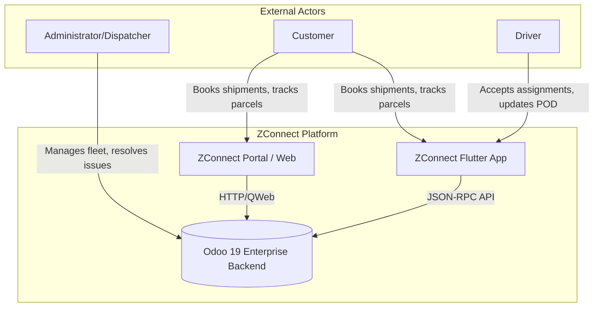

# Architecture & Design Rationale

## System Context Diagram
The ZConnect platform consists of the following primary components:

## Why Odoo?
Odoo was selected as the core backend for ZConnect because logistics platforms require robust state management, invoicing, user access control, and rapid API development. Building this from scratch would require reinventing an ORM, an authentication system, and an admin dashboard. Odoo provides these out-of-the-box, allowing the development focus to remain purely on the ZConnect business logic.

## Modular Architecture
Instead of building one monolithic `zconnect_core` module, the project is split into small, highly focused modules (`zconnect_shipment`, `zconnect_driver`, `zconnect_dispatch`, `zconnect_payment`, etc.).

**Rationale:**
1. **Separation of Concerns**: Dispatching logic shouldn't break shipment creation logic.
2. **Upgradeability**: Smaller modules are easier to migrate to future Odoo versions.
3. **Security**: We can apply targeted security rules (e.g., Driver-only access) at the module level.
4. **Maintainability**: New developers can easily locate domain-specific code.

## Standard vs. Custom Boundary
- **Standard Odoo**: Handles user authentication (`res.users`), partner contacts (`res.partner`), and fundamental website routing.
- **Custom ZConnect**: Everything related to Shipments (`zconnect.shipment`), Driver Assignments (`zconnect.dispatch.assignment`), Proof of Delivery (`zconnect.pod`), and Mobile API controllers is custom built to perfectly fit the Zimbabwean logistics context.
