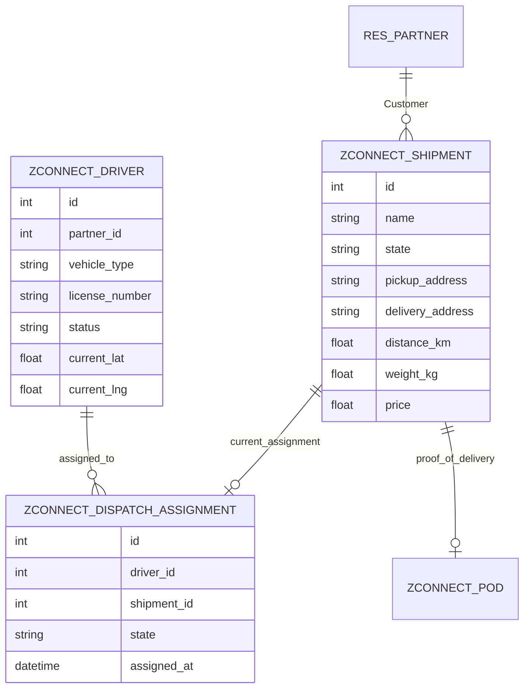

# Data Model & Database Architecture

## ER Diagram (Core Entities)

## Primary Models

### `zconnect.shipment`
- **Purpose**: The central entity of the platform. Represents a single delivery request.
- **Key Fields**:
  - `customer_id` (Many2one -> `res.partner`): The user who booked the shipment.
  - `pickup_contact_phone` / `delivery_contact_phone` (Char): Contact info for the respective parties.
  - `state` (Selection): `draft`, `confirmed`, `awaiting_payment`, `in_transit`, `delivered`, `cancelled`.
  - `pickup_latitude` / `pickup_longitude` (Float): Geospatial data for routing.
- **Notes**: Prices and distances are auto-computed upon creation or via the `action_calculate_quote()` method.

### `zconnect.driver`
- **Purpose**: Extends a standard user/partner to include fleet and delivery specific metrics.
- **Key Fields**:
  - `partner_id` (Many2one -> `res.partner`): Links the driver to standard Odoo contact data.
  - `current_lat` / `current_lng` (Float): Continuously updated by the mobile app via API for real-time tracking.

### `zconnect.dispatch.assignment`
- **Purpose**: A junction table with state. Handles the lifecycle of offering a shipment to a driver and tracking their acceptance.
- **Key Fields**:
  - `state` (Selection): `offered`, `accepted`, `rejected`, `completed`.
- **Notes**: Only one *active* assignment should exist per shipment, though historical rejected assignments are preserved for audit purposes.

## Database Note (PostgreSQL)
ZConnect utilizes Odoo's standard PostgreSQL ORM. All spatial data (latitude/longitude) is currently stored as standard floating-point numbers rather than utilizing the PostGIS extension. This design decision was made to ensure compatibility with all standard Odoo hosting environments without requiring complex OS-level dependencies, while still allowing the Flutter application to compute distances locally or via API integration.
