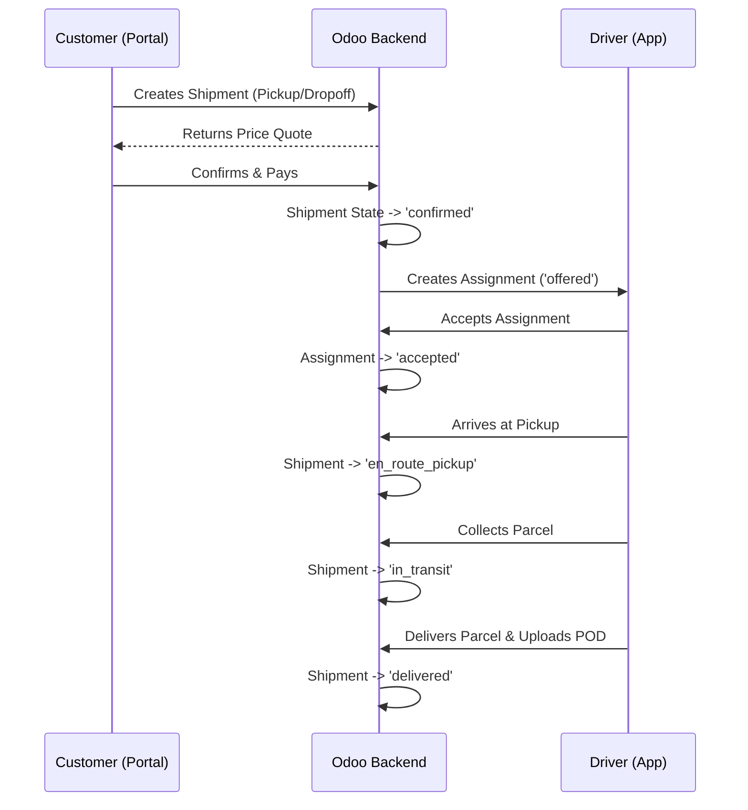

# Business Workflows

## Core Shipment Lifecycle

The standard ZConnect parcel delivery process follows a strict state machine implemented via standard Odoo Python methods and constrained by UI buttons.

## Detailed Workflow Breakdown

### 1. Customer Booking (Portal)
1. **Action**: Customer enters pickup/delivery locations on the portal map.
2. **Logic**: The JS frontend grabs `latitude` and `longitude` and performs an XML-RPC `create` call to `zconnect.shipment`.
3. **Transition**: The shipment is created in a `draft` state. The system triggers `action_calculate_quote()` which calculates the price based on `distance_km` and `weight_kg`.

### 2. Payment & Confirmation
1. **Action**: Customer clicks "Confirm & Pay".
2. **Logic**: If a payment gateway (e.g. Paynow) is selected, the state changes to `awaiting_payment`. Once the webhook confirms the payment (via `zconnect_payment` controllers), the state moves to `confirmed`.
3. **Fallback**: If Cash on Delivery is selected, the state immediately moves to `confirmed`.

### 3. Driver Dispatch
1. **Action**: Admin or Automated System assigns a driver.
2. **Logic**: A new `zconnect.dispatch.assignment` record is created. The driver receives a push notification (if integrated) and sees the offer in their Flutter app.
3. **Acceptance**: Driver clicks "Accept" in the app -> triggers the `/api/v1/zconnect/assignments/<id>/accept` endpoint. The shipment is now locked to this driver.

### 4. Proof of Delivery (POD)
1. **Action**: Driver hands over the parcel.
2. **Logic**: Driver captures a signature or photo via the Flutter app. This data is posted as base64 to `/api/v1/zconnect/shipments/<id>/pod`.
3. **Transition**: Odoo creates a `zconnect.pod` record, links the attachments, and marks the shipment as `delivered`.
